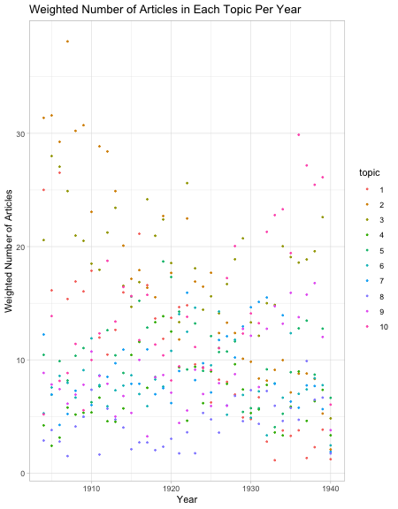
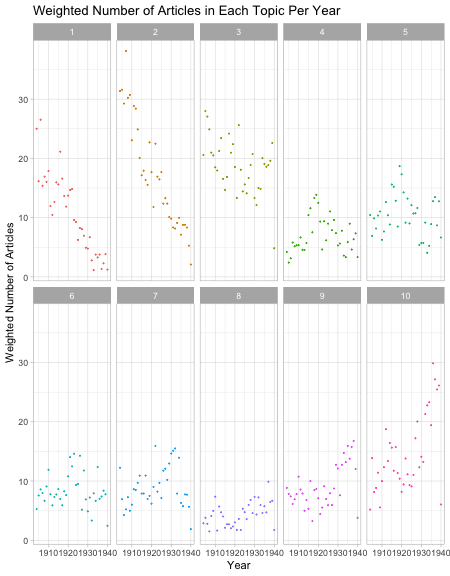

 
## Keywords for All Topics 
\newpage 


\newpage 
\newpage 


  
  
 
## Topic  1 
**Keywords**:  motor, neural, nervous, stimuli, muscular, stimulation, cerebral, reflex, responses, nerve, reactions, stimulus, psychic, introspective, introspection 

```
## Error in `combine_vars()`:
## ! At least one layer must contain all faceting variables: `journal`.
## * Plot is missing `journal`
## * Layer 1 is missing `journal`
```

\newpage 

