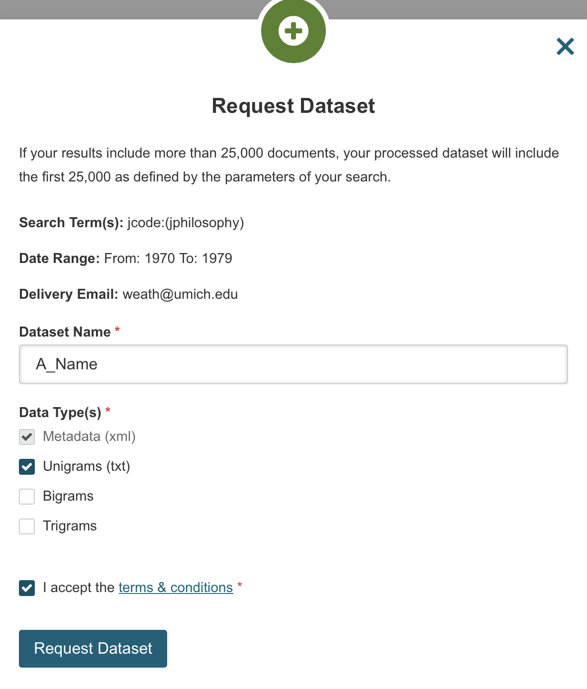

--- 
title: "A History of Philosophy Journals"
subtitle: "Volume 1: Evidence from Topic Modeling, 1876-2013"
author: "Brian Weatherson"
date: "Marshall M. Weinberg Professor of Philosophy, University of Michigan, Ann Arbor"
documentclass: book
link-citations: yes
site: bookdown::bookdown_site
description: Building models of the trends in philosophy journals using LDA.
bibliography: topic.bib
---

# Introduction {-}

```{r packages, echo=FALSE, message = FALSE, warning = FALSE, cache=FALSE}
knitr::opts_chunk$set(dpi=288)
knitr::opts_chunk$set(echo=FALSE)
knitr::opts_chunk$set(cache=TRUE)
knitr::opts_chunk$set(message=FALSE)
knitr::opts_chunk$set(warning=TRUE)
knitr::opts_chunk$set(fig.height = 8.2)
knitr::opts_chunk$set(fig.width = 7.5)
knitr::opts_chunk$set(results='asis')
require(tidyverse)
require(tidytext)
require(topicmodels)
require(knitr)
require(kableExtra)
require(corrr)
library(ggplot2); theme_set(theme_light())
require(DT)
```

```{r loader}
# Loads all the RData
# Cached because this takes forever each step
journal_short_names <- c(
  "Analysis" = "Analysis",
  "British Journal for the Philosophy of Science" = "BJPS",
  "Ethics" = "Ethics",
  "Journal of Philosophy" = "Journal of Philosophy",
  "Mind" = "Mind",
  "Noûs" = "Noûs",
  "Philosophical Review" = "Philosophical Review",
  "Philosophy and Phenomenological Research" = "PPR",
  "Philosophy and Public Affairs" = "P&PA",
  "Philosophy of Science" = "Philosophy of Science",
  "Proceedings of the Aristotelian Society" = "Aristotelian Society",
  "The Philosophical Quarterly" = "Philosophical Quarterly"
)

# The list of articles
load("fixed_articles.RData")

# The list of highly cited articles
load("highly_cited_articles.RData")

# The list of commonly used words (could calculate this from below)
load("common_words.RData")
source("short_words.R")

# How many topics we are using
cats <- 90

# The big LDA we're using
load("t90t15.RData")

# Rename it to the name I primarily use (and so it isn't overridden by other loads)
thelda <- refinedlda

# The application of the LDA to the 2019 Imprint articles
load("imprint_lda.RData")
```

```{r word_list_loader}
# The long word list
# This isn't on github because it might be proprietary
# It's in a different module because (a) it isn't on github and (b) it is really slow
load("all_journals_word_list.RData")
```

```{r gamma_setup}
# Gamma is the probability of article being in a topic
# This retrieves it, and rearranges the topics chronologically

all_journals_gamma <- tidy(thelda, matrix = "gamma")

all_journals_classifications <- all_journals_gamma %>%
  group_by(document) %>%
  top_n(1, gamma) %>%
  ungroup()

all_journals_titles_and_topics <- inner_join(all_journals_classifications, articles, by = "document")

year_topic_mean <- all_journals_titles_and_topics %>% ungroup() %>% 
  group_by(topic)  %>% 
  dplyr::summarize(date = mean(year)) %>% 
  mutate(rank = rank(date))

relabeled_articles <- merge(all_journals_titles_and_topics, year_topic_mean) %>% 
  select(-topic) %>% 
  dplyr::rename(topic = rank)

relabeled_gamma <- merge(all_journals_gamma, year_topic_mean) %>%
  as_tibble() %>%
  select(-topic) %>%
  dplyr::rename(topic = rank)

# Some code left over from before this was written in tidy
relabeled_gamma <- merge(relabeled_gamma, articles, by = "document") %>%
  select(document, gamma, topic, year, journal, length) %>%
  mutate(length = case_when(
                            is.na(length) ~ 1,
                            TRUE ~ length
                            ))
```

```{r import_categories, cache=FALSE}
# The big category csv
# Could type this in from R, but easier to edit as CSV
require(readr)
the_categories <- read_csv("category-summary-22031848-90-r15.csv")
```

```{r graphsetup}
# All the data for the big graphs in chapter 3
# Gotta build them first because some of them get drawn on for the individual topics in chapter 2
  article_demonimator <-  relabeled_articles  %>%
    group_by(year) %>%
    dplyr::summarise(d = n_distinct(document))

  page_demonimator <- relabeled_articles %>%
    group_by(year) %>%
    dplyr::summarise(d = sum(length, na.rm = TRUE))
  
  count_numerator <- relabeled_articles  %>%
    group_by(year, topic) %>%
    dplyr::summarise(y = n_distinct(document)) %>%
    ungroup() %>%
    complete(year, topic, fill = list(y = 0))

  count_ratio <- merge(count_numerator, article_demonimator) %>%
    mutate(y = y/d)
  
  page_count_numerator <- relabeled_articles %>%
    group_by(year, topic) %>%
    dplyr::summarise(y = sum(length, na.rm=TRUE)) %>%
    ungroup() %>%
    complete(year, topic, fill = list(y = 0))

  page_count_ratio <- merge(page_count_numerator, page_demonimator) %>%
    mutate(y = y/d)
  
  weight_numerator <- relabeled_gamma %>%    
    group_by(year, topic) %>%
    dplyr::summarise(y = sum(gamma)) %>%
    ungroup() %>%
    complete(year, topic, fill = list(y = 0))

  weight_ratio <- merge(weight_numerator, article_demonimator) %>%
    as_tibble() %>%
    mutate(y = y/d)
  
  page_weight_numerator <- relabeled_gamma %>%    
    group_by(year, topic) %>%
    mutate(gl = gamma * length) %>%
    dplyr::summarise(y = sum(gl, na.rm = TRUE)) %>%
    ungroup() %>%
    complete(year, topic, fill = list(y = 0))

  page_weight_ratio <- merge(page_weight_numerator, page_demonimator) %>%
    mutate(y = y/d)
  
  journalgamma <- relabeled_gamma  %>%
    group_by(year, topic, journal) %>%
    dplyr::summarise(gamsum = sum(gamma)) %>%
    ungroup() %>%
    complete(year, topic, journal, fill = list(gamsum = NA))
  
  yearjournalcount <- relabeled_articles %>%
    group_by(journal, year) %>%
    dplyr::summarise(annual = n_distinct(document))
  
  journalgamma_frequency <- merge(journalgamma, yearjournalcount) %>%
    mutate(gamfre = gamsum / annual) %>%
    complete(year, journal, topic, fill = list(gamfre = NA))  
```

```{r astopic, cache=FALSE}
# The topics are naturally numbers so they get continuous colors
# Turning them into factors makes the automatic coloring work
# I also use this to relabel and rearrange the journal titles
# Burp
  count_numerator$topic <- as.factor(count_numerator$topic)
  page_count_numerator$topic <- as.factor(page_count_numerator$topic)
  weight_numerator$topic <- as.factor(weight_numerator$topic)
  page_weight_numerator$topic <- as.factor(page_weight_numerator$topic)
  count_ratio$topic <- as.factor(count_ratio$topic)
  page_count_ratio$topic <- as.factor(page_count_ratio$topic)
  weight_ratio$topic <- as.factor(weight_ratio$topic)
  page_weight_ratio$topic <- as.factor(page_weight_ratio$topic)
  journalgamma_frequency$topic <- as.factor(journalgamma_frequency$topic)
  
journal_order <- c("Mind", "Proceedings of the Aristotelian Society", "Ethics", "Philosophical Review",  "Analysis","Philosophy and Public Affairs", "Journal of Philosophy", "Philosophy and Phenomenological Research", "Philosophy of Science", "Noûs",  "The Philosophical Quarterly", "British Journal for the Philosophy of Science")

journalgamma_frequency$journal <- factor(journalgamma_frequency$journal, levels = journal_order)
```

```{r keywordsetup}
# Generate two things for the topic summaries in chapter 2
# First, the keywords, which are a complicated thing to make, since the beta matrix is huge
# Second, the highly cited list, which is actually fairly easy -though have to check it is up to date
  phil_topics <- tidy(thelda, matrix = "beta")

  relabeled_topics <- merge(phil_topics, year_topic_mean) %>%
    as_tibble() %>%
    select(-topic) %>%
    dplyr::rename(topic = rank)

  word_score <- relabeled_topics %>%
    group_by(term) %>%
    dplyr::summarise(sumbeta = sum(beta)) %>%
    arrange(desc(sumbeta))

 busy_topics <- merge(relabeled_topics, word_score) %>%
   filter(sumbeta > 0.00005 * cats) %>%
   mutate(score = beta/sumbeta) %>%
   arrange(desc(score))

 distinctive_topics <- busy_topics %>%
   group_by(topic) %>%
   top_n(15, score) %>%
   ungroup() %>%
   arrange(desc(-topic))

 short_keywords <- c()

 short_keywords <- tribble(
   ~topic, ~distinctive_words)
  
  high_cite_gamma <- merge(highly_cited, relabeled_articles, by = "document") %>% arrange(desc(Cites))

```

```{r overall_stats}
# Put all the stats for chapter 2 into one table that I can draw out
overall_stats <- tibble(
  the_topic = 1:90,
  r_count = 0,
  w_count = 0,
)


for (i in 1:90){
  overall_stats$r_count[i] <- nrow(relabeled_articles %>% filter(topic == i))
  overall_stats$w_count[i] <- round(sum(filter(relabeled_gamma, topic == i)$gamma), 1)
}

overall_stats <- overall_stats %>%
  mutate(r_percent = round(r_count / nrow(relabeled_articles), 3)) %>%
  mutate(r_rank = order(order(r_count, decreasing=TRUE))) %>%
  mutate(w_percent = round(w_count / nrow(relabeled_articles), 3)) %>%
  mutate(w_rank = order(order(w_count, decreasing=TRUE))) %>%
  mutate(w_over_r = w_count - r_count) %>%
  mutate(gap_rank = order(order(w_over_r, decreasing=TRUE))) %>%
  mutate(wy = 0)

temp_years <- relabeled_gamma %>%
  select(topic, gamma, year) %>%
  mutate(yg = gamma * year)

for (i in 1:90){
  overall_stats$wy[i] = round(sum(filter(temp_years, topic == i)$yg)/overall_stats$w_count[i], 1)
}

overall_stats <- overall_stats %>%
  add_column(mean_y = 0, median_y = 0, modal_y = 0)

for (i in 1:90){
  temp_years <- relabeled_articles %>% filter(topic == i)
  overall_stats$mean_y[i] = round(mean(temp_years$year), 1)
  overall_stats$median_y[i] = round(median(temp_years$year), 0)
  overall_stats$modal_y[i] = as.numeric(names(sort(-table(temp_years$year)))[1])
}
```

```{r cross-topic}
# Average gamma in topic y for articles in topic x
# Useful quick-and-dirty overlap between topics measure
cross_topic <- function(x, y){
  t <- relabeled_articles %>% filter(topic == x)
  s <- relabeled_gamma %>% filter(topic == y, document %in% t$document)
  sum(s$gamma)
}
```

```{r cross-topic-two}
# Create tables from the cross-topic function
short_articles <- relabeled_articles %>%
  select(document, hometopic = topic)

cross_topic_tibble <- relabeled_gamma %>%
  inner_join(short_articles, by = "document") %>%
  group_by(topic, hometopic) %>%
  dplyr::summarise(g = mean(gamma)) %>%
  filter(!topic == hometopic) %>%
  select(topic = hometopic, othertopic = topic, g) %>%
  arrange(topic, othertopic)

closest_neighbour <- cross_topic_tibble %>%
  group_by(topic) %>%
  top_n(1, g)

closest_neighbour_inverse <- cross_topic_tibble %>%
  group_by(othertopic) %>%
  top_n(1, g) %>%
  arrange(othertopic)

furthest_neighbour <- cross_topic_tibble %>%
  group_by(topic) %>%
  top_n(1, -g)

furthest_neighbour_inverse <- cross_topic_tibble %>%
  group_by(othertopic) %>%
  top_n(1, -g) %>%
  arrange(othertopic)

```


```{r kable-for-article-probabilities}
# A function for making a quick table of an article's distribution over the 90 topics
# This is first used in chapter 2
individual_article <- function(x){
  temp_article <- relabeled_articles %>%
  filter(document == x)

temp_gamma <- relabeled_gamma %>%
  filter(document == x, gamma > 0.02) %>%
  select(topic, gamma) %>%
  inner_join(the_categories, by = "topic") %>%
  select(subject, gamma) %>%
  arrange(-gamma)

kable(temp_gamma, 
      col.names = c("Subject", "Probability"), 
      caption = temp_article$citation[1],
      digits = c(0, 4)) %>% 
  kable_styling(full_width = F)
}
```

```{r dt-for-author-articles}
author_dt <- function(x, y){
datatable(relabeled_articles %>%
          filter(auth1 %in% x | auth2 %in% x | auth3 %in% x) %>%
          arrange(topic) %>%
         inner_join(the_categories, by = "topic") %>%
          select(year, citation, subject, gamma),           
          colnames = c("Year", "Article", "Subject", "Probability"), 
          rownames = FALSE,
          options = list(columnDefs = list(list(className = 'dt-left', targets = 0:3)),
                         pageLength = 10
                         ),
          caption = htmltools::tags$caption(paste0("Articles with Author ",y), style = "font-weight: bold")
    )%>%
      formatSignif('gamma',4) %>%
      formatStyle(1:4,`text-align` = 'left')  
} 
```

```{r kable-for-author-articles}
author_kable <- function(x, y){
kable(relabeled_articles %>%
          filter(auth1 %in% x | auth2 %in% x | auth3 %in% x) %>%
          arrange(year) %>%
        mutate(gamma = round(gamma, 4)) %>%
         inner_join(the_categories, by = "topic") %>%
          select(year, citation, subject, gamma),           
          col.names = c("Year", "Article", "Subject", "Probability"), 
          caption = paste0("Articles with Author ",y), style = "font-weight: bold")
} 
```

```{r words-by-year}
# Use this to get words to graph
# This gets used in chapter 7

article_year_tibble <- articles %>%
  select(document, year)

word_year_count <- all_journals_tibble %>%
  inner_join(article_year_tibble, by = "document") %>%
  group_by(year) %>%
  dplyr::summarise(a = sum(wordcount))

word_year_journal_count <- all_journals_tibble %>%
  inner_join(articles, by = "document") %>%
  group_by(year, journal) %>%
  dplyr::summarise(a = sum(wordcount))


```

```{r word-frequency-graphs}
# A pair of functions that turn a string of words into a graph of each of their frequencies over time
# Have to generate the data first, because would be enormous table to have it all stored
# These get used in chapter 7
word_year_frequency <- function(x){
  left_join(word_year_count, all_journals_tibble %>%
    filter(word == x) %>%
    left_join(article_year_tibble, by = "document") %>%
    group_by(year) %>%
    dplyr::summarise(c = sum(wordcount)),
    by = "year") %>%
    replace_na(list(c = 0)) %>%
    mutate(f = c / a) %>%
    mutate(term = x)
}

frequency_summary <- function(x){
  denom <- sum(all_journals_tibble$wordcount)
  numer <- sum(filter(all_journals_tibble, word == x)$wordcount)
  zz <- numer/denom
  tribble(
    ~term, ~the_mean,
    x, zz
  )
}


word_frequency_graphs <- function(x){
  t <- lapply(x, word_year_frequency) %>% bind_rows()
  h <- lapply(x, frequency_summary) %>% bind_rows()
ggplot(t, aes(x = year, y = f, color = term, group = term)) +
  freqstyle +
  geom_point(size = 0.6, alpha = 0.8) +
#  geom_hline(yintercept = h$the_mean, col = group) +
  stat_summary(fun = mean, 
               aes(x = 1950, yintercept = ..y.., group = term), 
               geom = "hline",
               linetype = "dashed",
               size = 0.2) +
  scale_x_continuous(minor_breaks = 10 * 1:201,
                     expand = expansion(mult = c(0.01, 0.01))) +
  scale_y_continuous(expand = expansion(mult = c(0.01, .03)),
                     minor_breaks = scales::breaks_pretty(n = 12),
                     breaks = scales::breaks_pretty(n = 3),
                     labels = function(x) ifelse(x > 0, paste0("1/",round(1/x,0)), 0)) +
  #  scale_y_continuous(labels = scale_inverter) +
  labs(x = element_blank(), y = "Word Frequency") +
  theme(legend.title = element_blank())
}
```

```{r word-era-graphs}
word_era_graphs <- function(x, y){
  word_freq_data <- era_words %>%
    filter(word %in% slice(common_words, 1:x)$word) %>%
    filter(epoch == y) %>%
    arrange(-f) %>%
    ungroup() %>%
    slice(1:5)
  print(word_frequency_graphs(word_freq_data$word))
}
```

```{r imprint-setup}
# Extract the gammas from imprint_lda and renumber chronologically
imprint_gamma<- as_tibble(imprint_lda$topics, rownames = NA) %>%
  rownames_to_column(var = "document") %>%
  pivot_longer(-document) %>%
  select(document, topic = name, gamma = value) %>%
  mutate(topic = as.integer(topic)) %>%
  inner_join(year_topic_mean, by = "topic") %>%
  select(document, topic = rank, gamma) %>%
  arrange(document, gamma)

# Sum gammas over the 54 Imprint articles
imprint_summary <- imprint_gamma %>%
  group_by(topic) %>%
  dplyr::summarise(g = sum(gamma))

# Top gamma for each article 
imprint_top_gamma <- imprint_gamma %>%
  group_by(document) %>%
  top_n(1, gamma)
```

```{r load-bad-lda}
# The LDA I use for the buzzwords section right at the end
# Everything goes wrong when this is cached and doesn't load
load("~/Dropbox/journals-lda/t90t100.RData")
```

```{r setup-bad-lda}

# Just replicate the normal setup, but with The Bad LDA
bad_gamma <- tidy(refinedlda, matrix = "gamma") %>%
  filter(topic == 6) %>%
  inner_join(articles, by = "document") %>%
  select(citation, gamma, journal, year) %>%
  arrange(-gamma)

bad_gamma_year <- bad_gamma %>%
  group_by(year) %>%
  summarise(g = sum(gamma))%>%
  inner_join(article_demonimator, by = "year") %>%
  mutate(y = g / d)
  
# Graph absolute and ratio

bad_gamma_year_journal <- bad_gamma %>%
  group_by(year, journal) %>%
  summarise(g = sum(gamma)) %>%
  inner_join(yearjournalcount, by = c("year", "journal")) %>%
  mutate(y = g / annual)

bad_gamma_year_journal$journal <- factor(bad_gamma_year_journal$journal, levels = journal_order)

# Graph absolute and ratio

bad_beta <- tidy(refinedlda, matrix = "beta") %>%
  filter(topic == 6) %>%
  filter(term %in% all_word_count$word) %>%
  select(word = term, beta) %>%
  inner_join(all_word_count, by = "word") %>%
  mutate(y = beta/total * sum(all_word_count$total)) %>%
  arrange(-y)
```

```{r comparison-beta-tables}
good_beta <- relabeled_topics %>%
  filter(topic == 90) %>%
  filter(term %in% all_word_count$word) %>%
  select(word = term, beta) %>%
  inner_join(all_word_count, by = "word") %>%
  mutate(y = beta/total * sum(all_word_count$total)) %>%
  arrange(-y)

kant_beta <- relabeled_topics %>%
  filter(topic == 32) %>%
  filter(term %in% all_word_count$word) %>%
  select(word = term, beta) %>%
  inner_join(all_word_count, by = "word") %>%
  mutate(y = beta/total * sum(all_word_count$total)) %>%
  arrange(-y)

olp_beta <- relabeled_topics %>%
  filter(topic == 24) %>%
  filter(term %in% all_word_count$word) %>%
  select(word = term, beta) %>%
  inner_join(all_word_count, by = "word") %>%
  mutate(y = beta/total * sum(all_word_count$total)) %>%
  arrange(-y)
```

```{r category_gamma_setup}
# I recreate category_gamma from inside the script
# Need to build all_dtm because gotta assign probabilities from within the binary sorts to all articles
word_list <- all_journals_tibble %>%
  filter(wordcount > 3) %>%
  filter(!word %in% short_words) %>%
  filter(document %in% articles$document)


all_dtm <- cast_dtm(word_list, document, word, wordcount)
```

```{r category_gamma_derive}
split_check <- filter(the_categories, cat_num == 13)$topic

category_gamma <- relabeled_gamma %>%
  select(document, topic, gamma)

for (i in split_check){
  load(paste0("binary_lda/lda_",i,".RData"))
  temp_lda <- posterior(binary_lda, all_dtm)
  temp_gamma<- as_tibble(temp_lda$topics, rownames = NA) %>%
    rownames_to_column(var = "document") %>%
    pivot_longer(-document) %>%
    select(document, btopic = name, bgamma = value)
  temp_old_gamma <- category_gamma %>%
    filter(topic == i) %>%
    inner_join(temp_gamma, by = "document") %>%
    mutate(topic = as.numeric(topic)) %>%
    mutate(btopic = as.numeric(btopic)) %>%
    mutate(topic = 100*topic + btopic) %>%
    mutate(gamma = gamma*bgamma) %>%
    select(-btopic, -bgamma)
 category_gamma <- category_gamma %>%
   filter(!topic == i) %>%
   bind_rows(temp_old_gamma)
}

category_gamma <- category_gamma %>%
  inner_join(the_categories, by = "topic")

articles_by_category <- category_gamma %>%
  group_by(document) %>%
  top_n(1, gamma) 
```

```{r category_setup}
category_gamma_graph <- category_gamma %>%
  inner_join(articles, by = "document") %>%
  select(journal, year, category = cat_name, gamma) %>%
  group_by(journal, year, category) %>%
  dplyr::summarise(g = sum(gamma)) %>%
  ungroup() %>%
  complete(journal, year, category, fill = list(g = NA))

category_year <- category_gamma_graph %>%
  group_by(category, year) %>%
  dplyr::summarise(y = sum(g, na.rm=TRUE))

year_denominator <- category_gamma_graph %>%
  group_by(year) %>%
  dplyr::summarise(d = sum(g, na.rm = TRUE))

category_frequency <- inner_join(category_year, year_denominator, by = "year") %>%
  mutate(f = y / d)
```

Anglophone philosophy in the twentieth century was centered, to an unprecedented extent, around journals: periodical publications that aimed to present (one vision of) the best philosophical work of the moment. By looking at the trends across these journals, we can see important trends in philosophy itself.

But looking at the journals is easier said than done. Most major journals have published thousands of articles. If we want to get a guide to philosophy as a whole, and not just to one particular vision of it, we need to look at several different journals. And now we're needing to look at tens of thousands of articles. This is impossible for any human to do.

Fortunately, we don't just have to rely on humans. Two technological developments have made it practical to use computers to do at least some of the reading for us.

The first development was that JSTOR used optical character recognition (OCR) software to create text versions of many archived journals. They combined this with the original electronic versions of recent issues to create a full library of the text of many leading journals. And, crucially, they made this library available to the general public.

The second development was that personal computers have gotten fast enough that it is (just barely) practical to run text mining algorithms over libraries as large as the ones JSTOR provides on personal computers.^['Practical' here is a relative term; the models I primarily use here took 8-10 hours to complete on pretty good computers. But that's fine if you can leave a computer running overnight.] So even without having to use tools beyond what's available in a typical university office, we can use these algorithms to see trends in the journal data. 

This study focuses on the following twelve journals.

```{r journal-table}
journals_summary <- articles %>%
  dplyr::group_by(journal) %>%
  dplyr::summarise(fyear = min(year), art = n_distinct(document))
  kable(journals_summary, 
        col.names = c("Journal", "First Year", "Number of Articles"), 
        align=c("l", "c", "c"),
        caption = "The twelve journals that this book talks about"
  )
    
```

That table shows the twelve journals I'm using, the year they started publication, and how many articles from each journal I'm analysing. That doesn't include everything the journal published, since I'm only looking at the research articles they published in English. So I'm not looking at book reviews, but also not at editorials, introductions, corrections and the like. Because the text mining algorithms really require a single language, I'm also excluding everything that was published in languages other than English.^[I had no idea how many articles in French, German and Spanish were published in these journals over the years.] But even still, there are a lot of articles to look at, and they include many of the most important works in philosophy over that time period.

The data comes from JSTOR's [Data For Researchers](https://jstor.org/dfr/), which provides, for each article in these journals, a file with a list of the words in the article and the number of times those words appear. Though as will become important in what follows, this data separates hyphenated words, excludes various common words like 'and' and 'the', and also excludes all one and two letter words.

JSTOR has a moving window, which means it doesn't make available the latest issues of all of the journals. When I started this project, the last year that I could get access to all issues of all 12 journals was 2013. So this study stops in 2013. I make a number of anecdotal observations about what's happened since 2013 during this book. And at the end I come back to one study on work from 2019. But this is primarily a history of the years 1876-2013.

I used the data from JSTOR to build a Latent Dirichlet Allocation (LDA) model of the journals using the [topicmodels](https://cran.r-project.org/package=topicmodels) package written by [Bettina Grün](http://ifas.jku.at/gruen/) and [Kurt Hornik](http://statmath.wu.ac.at/~hornik/), and described by them in @GrunHornik2011.

An LDA model takes the distribution of words in articles and comes up with a probabilistic assignment of each paper to one of a number of topics. The number of topics has to be set manually, and after some experimentation it seemed that the best results came from dividing the articles up into `r cats` topics. And a lot of this book discusses the characteristics of these `r cats` topics. But to give you a more accessible sense of what the data looks like, I'll start with a graph that groups those topics together into familiar contemporary philosophical subdisciplines, and displays their distributions in the 20th and 21st century journals.^[I'm leaving the 19th century off this graph because it is odd in various ways, and best treated separately. I'll say much more about it as we proceed.]

```{r initial-graph-style, cache = FALSE}
facetstyle <-   theme_minimal() +
  theme(text = element_text(family="Lato"),
        plot.title = element_text(size = rel(1), 
                                  family = "Lato",
                                  face = "bold",
                                  margin = margin(0, 0, 10, 0)),
        strip.text = element_blank(),
        panel.spacing.x = unit(-0.05, "lines"),
        panel.background = element_blank(),
        panel.spacing.y = unit(1, "lines"),
        axis.title.x = element_text(size = rel(1),
                                    margin = margin(t = 6, r = 0, b = 0, l = 0)),
        axis.title.y = element_text(size = rel(1),
                                    margin = margin(t = 0, r = 8, b = 0, l = 0)),
        panel.grid.major.y = element_line(color = "grey85", size = 0.07),
        panel.grid.minor.y = element_line(color = "grey85", size = 0.03),
        panel.grid.major.x = element_blank(),
        panel.grid.minor.x = element_blank(),
        legend.position="none")
spaghettistyle <- facetstyle +
  theme(panel.grid.major.y = element_line(color = "grey80", size = 0.08),
        panel.grid.minor.y = element_line(color = "grey85", size = 0.04),
        legend.text = element_text(size = rel(0.5)),
        plot.caption = element_text(size = rel(0.7))
        )
freqstyle <-   spaghettistyle +
  theme(legend.text = element_text(size = rel(0.75)),
          panel.grid.major.y = element_line(color = "grey85", size = 0.08),
        legend.position = "right")
chap_two_facet_labels <- tribble(
  ~journal, ~short_name,
  "Mind", "Mind",
  "Philosophical Review", "Philosophical Review",
  "Journal of Philosophy", "Journal of Philosophy",
  "Noûs", "Noûs",
  "Proceedings of the Aristotelian Society", "Aristotelian Society",
  "Analysis", "Analysis",
  "Philosophy and Phenomenological Research", "PPR",
  "The Philosophical Quarterly", "Philosophical Quarterly",
  "Ethics", "Ethics",
  "Philosophy and Public Affairs", "Philosophy & Public Affairs",
  "Philosophy of Science", "Philosophy of Science",
  "British Journal for the Philosophy of Science", "BJPS"
)

# Changing the text in the theme just changes the labels on the axis etc
# To change what's in the graph itself, you need to use these commands
# And I'm using a hack to get the titles for the graph appearing in the graph, so...
update_geom_defaults("text", list(family = "Lato"))
update_geom_defaults("label", list(family = "Lato"))

```

```{r first-facet-graph, fig.cap = "Proportion of articles in each category per year"}
tt <- filter(category_frequency, year > 1899) # Remove 19th Century from graph
category_graph_labels <- tt %>%
  group_by(category) %>%
  summarise(year = median(year)) %>% # Put label at middle horizontally
  mutate(f = max(tt$f) * 1.2) # Put label above the highest value on the graph
ggplot(tt, 
       aes(x = year, y = f, color=category, group=category)) +
  geom_text(data = category_graph_labels,
            mapping = aes(label = category),
            vjust = "inward", 
            hjust = "inward",
            fontface = "bold", 
            size = 3) +
  labs(x = element_blank(), y = "Proportion of Articles", title = "Trends in Philosophical Categories") +
  geom_point(size = 0.15) + 
  facet_wrap(~category, ncol=3) +  
  scale_x_continuous(expand = expansion(mult = c(0.05, 0.05)),
                     breaks = 25 * 77:80) +
  scale_y_continuous(breaks = c(0.1,0.2),
                     expand = expansion(mult = c(0, .03))) +
  facetstyle
```

These graphs aren't smoothed - this is just a scatterplot of how prevalent each category is over time. The contintuity in the graphs comes from continuity in the underlying subject matter. Although philosophy changes over time, the changes tend to be small and smooth - at least at this level of resolution. 

There are, however, a few big trends that are visible even at this resolution. 

The categories of Ethics and Philosophy of Science have fairly steady rises over the graphs. What primarily drives that is that journals we think of as specialist journals, like _Ethics_ and _Philosophy of Science_, became more and more specialised over time. There is much more topic overlap between these journals and so-called generalist journals in the 1940s and 1950s than in the 1990s and 2000s. 

For much of the history of these journals, they publish approximately zero articles that look anything like contemporary epistemology. Edmund Gettier's famous article [Is Justified True Belief Knowledge?](https://philpapers.org/rec/GETIJT-4) [@Gettier1963] doesn't advance an existing debate; it starts a debate. But that debate doesn't really get going for another decade or more.

On the other hand, in the middle of that graph above is a chart that does not reflect anything in contemporary philosophy: Idealism. The extent to which Idealism dominated philosophy before World War I, and continued to be a huge presence between the wars, quite astounded me. And the model is using a fairly narrow definition of Idealism here. Idealist influenced works on social and political philosophy, such as work that engages heavily with Bergson and Santayana, is another huge field, but it's included in Social and Political Philosophy above.

The anecdote I'd always been told about the state of British philosophy in the early part of the century was that you could get a good sense of things by just looking at the issue of _Mind_ that included [On Denoting](https://philpapers.org/rec/RUSOD) [@Russell1905]. It's wedged between two big articles on Idealism. Indeed, the model classifies the articles just [before](https://philpapers.org/rec/RFAPVA-2) and just [after](https://philpapers.org/rec/GIBPAP) Russell's in the Idealism category. But I, at least, had no idea how dominated British philosophy was by Idealism, or how long this dominance lasted.

This was far from the only thing that surprised me about the data. Some of these surprises probably reflect my ignorance, but some of them may be of wider interest.

As you might have gathered from the quantity of work on Idealism, there just isn't much space for the work that we now think is most significant in late-nineteenth or early-twentieth century philosophy. Frege, Moore, Russell and even Wittgenstein have virtually zero impact on the journals at the time they publish. They do have an impact later, with the starting times of their influence being in more or less in reverse chronological order to when they actually wrote. But they are invisible in real time. This is especially striking for Moore, who does not seem to have used his influence as editor of _Mind_ to steer the journal particularly in the direction of his work. The contrast with the generation of editors who came after him, on either side of the Atlantic, will be striking.

As well as Idealism, two other broadly anti-realist schools make a major impact on the journals in the first half of the twentieth century: Pragmatism and Positivism. But the impacts differ greatly in size. Idealism has a much bigger impact than Pragmatism, and Pragmatism has a much bigger impact than Positivism. Indeed, the main way that Positivism is visible is that it has a very prominent decline phase. The 'one patch per puncture' period of attempts to save the verification principle is big enough that it is basically one of the `r cats` topics the model finds. But this model doesn't find a ton of work defending positivism turning up as a distinctive topic, nor does it find a notable falling away in the fields (like Metaphysics and Mind) that positivists railed against. It's possible that the focus on journals that primarily publish in English explains why I didn't see a 'rise of positivism' period, but its absence was striking.

If there is no early analytic/logical atomism visible, and positivism is a small presence that shows up mainly as it is dying, what fields that are part of the standard story of the history of analytic philosophy do show up? Well, the first big one is [Ordinary Language Philosophy](#topic24). This is so big, especially in Britain, that it almost breaks the model. The big assumption that drives the kind of model I'm building is that there is a one-one mapping between classes of articles with a distinctive vocabulary, and classes of articles with a distinctive subject matter. That often holds true, but it breaks quite spectacularly in 1950s Britain. A new language, shorn of pomp and circumstance, takes over. And my poor model thinks that all the philosophers have moved on to a wholly new subject matter. But they largely have not - they are just discussing the old subjects using new words.

There is one notable exception to this though. During the Ordinary Language phase we do see a lot of articles that are about language itself. This is a new thing - we don't see any such articles before then. That's an exaggeration of course - "On Denoting" really was published - but it's true as a generalisation. But all of a sudden in the middle of the century there is a spike in interest in [Wittgensteinian philosophy of language](#topic22). That spike falls away almost as quickly as it came, but it changes the field. The space that was taken up by Wittgensteinian philosophy of language is replaced by other work in philosophy of language, influenced in the first place by either Frege, Russell, Quine or Austin. 

There is something about this story that we see repeated across the subjects. When one particular topic falls out of fashion, it is usually replaced by one from the same sub-discipline. That's how we get the very stable lines on the graphs above, although most categories are made up of topics that see sharp rises and falls in the amount of attention they are getting. But Philosophy of Language is a bit of an exception. Before the Wittgensteinian boom it was invisible in the journal; afterwards it routinely accounted for 10% of the published articles. And that 10% figure stayed stable across huge shifts in what philosophers of language were talking about. What surprised me was that the stability here was the norm - the sudden appearance of a new field taking up 10% of the journal space was what was unusual.

But what interests me as much as these big picture trends are the little trends underlying them. What particular topics do philosophers talk about, and when do they talk about them? The answer to the latter question is almost always several years later than I had expected. To take one dramatic example, I associate work on [Wide Content](#topic85) with Kripke and Putnam's work from the early 1970s, and hence with the 1970s as a whole. But it turns out this work is practically invisible in the 1970s journals. [Meaning and Reference](https://philpapers.org/rec/PUTMAR-2) [@Putnam1973] shows up, but almost nothing else does until a decade or more later. And that's the general pattern; if you associate a topic with its most famous papers, you'll be misled about when it primarily shows up in the journals.

So I'll spend some time in what follows looking at when familiar topics show up. But I'll also be looking at what shows up that isn't part of contemporary philosophy. I've spent a bit of time talking about Idealism, but it isn't the only thing missing from current journals. There used to be much more work on, broadly construed, [philosophy of history and of sociology](#topic10) than there is now. This has one particular impact that intersects with my other interests. Anglophone philosophers nowadays do spend a bit of time on philosophically significant work from the late eighteenth century. But not much of the work that they look at comes from Philadelphia, or Paris, let alone Cap-Haïtien. Although it's not like mid-century philosophers paid any attention to Cap-Haïtien in the late eighteenth century either, but they did think a bit more about the philosophical importance of what happened, and what was written, at that time in Philadelphia and Paris. And that seems like a good idea. Also, hopefully one of the benefits of the kind of retrospective I'm writing is it encourages people to look back and see what else we used to spend more time on, and could profitably spend more time on in the future.

## Plan {-}

The book has nine chapters, and it loosely divides into three parts, with three chapters in each part.

The first part concerns the 90 topics that the model divides the articles into. Chapter \@ref(methodology-chapter) is about how and why I made the choices I did in providing the inputs to the model. Chapter \@ref(all-90-topics) goes through each of these 90 topics one at a time. As well as producing some automated statistics and graphs for each topic, and listing which articles are in each topic, I make some small comments about the topic. These are mostly about the content of the topic and its place in philosophical history, though I also spend a lot of time talking about how the model made its division into topics. Most of the comments here are short, though occasionally I decide that one topic needs 2500 words or more. Chapter \@ref(summary-graphs) is about my attempts to make a legible graph of all 90 topics through time. I run through a lot of different representations of the data; most of them are failures, but some of them are more interesting failures than others.

The second part looks at what happens if instead of making a 90-way division into somewhat novel topics, we try a 12 way division into familiar topics. So I divide the articles up into common contemporary categories, like Episemology, Ethics, Metaphysics and Philosophy of Science, and look at the trends in these categories. Chapter \@ref(categorychapter) goes over the trends in the 12 categories. Chapter \@ref(sortingchapter) goes over how I made these divisions, with a special focus on where the categories do, and do not, run into each other. And chapter \@ref(epistemologychapter) looks at one of these categories: Epistemology. This is in part for self-interested reasons; it's the field I work in. But it's in part because the data about Epistemology were so surprising. Epistemology, as it is currently practiced, is basically invisible in the journals before World War II. And the most famous part of contemporary Epistemology, the Gettier problem, plays a surprisingly small role in recent years.

The third part looks at further applications of the model. The first six chapters had used years as the main unit of temporal measurement. In Chapter \@ref(eraschapter) I use more coarse-grained measures. First I look at the trends over five 'eras' in philosophy, and then over twelve decades. One benefit of doing things this way is that as well as looking at what the model says, I can look at trends in the underlying data directly, and see how well the model is tracking reality. In Chapter \@ref(outliers) I look at outliers along various dimensions, both to see where extreme events have been happening, and to put some stress on the model. If it's most outlandish claims are true, and I think several of them are, then we should have more confidence in its more mundane claims. And in Chapter \@ref(lookingoutward) I try to look beyond the model. I use the model to compare the early years of the journals with some famous books that were published around the same time. Then I look at how articles in Philosophers' Imprint in 2019 compare to what we saw before 2013. (The big story is the resurgence of interest in historical figures outside the standard canon.) And finally I look at something that almost blew up the project: the very distinctive vocabulary of 21st Century Philosophy.

## Website Instructions {-}

This book isn't meant to be read cover to cover; it's meant to be picked through like the proverbial box of chocolates. To make this easier, there is a full table of contents on the sidebar. If you click on any of the chapter headings, it take you to that chapter, and expand to list all the sections in that chapter. Then you can go directly to the section.

The sidebar is also scrollable separately from the rest of the text. If you put the mouse in the sidebar and scroll, it will move the sidebar not the main text. This is particularly important in chapter 2, where there are more sections than will fit on most screens.

But the sidebar takes up quite a bit of real estate, especially on a tablet. So if you want to hide it, either hit 's', or click the <i class="fa fa-align-justify"></i> button in the top left. If the sidebar is hidden, doing either of those things will restore it. If you're reading on a phone, the sidebar should be hidden by default.

Next to <i class="fa fa-align-justify"></i>, the <i class="fa fa-search"></i> icon brings up a search box for searching the book. Though note that this only searches the text of the book; it doesn't search the various tables. Clicking 'f' also brings up, or hides if it is already present, the search box.

The <i class="fa fa-font"></i> icon lets you adjust the appearance of the book. You can set the background to white (by default), sepia or dark. Unfortunately, this doesn't change the appearance of the graphs, which will be white no matter what you pick. So I don't love how it looks with different colors, but the option is there. You can also change the font so the body of the book is in the serif font that's used in the titles. And you can increase or decrease the font size.

The <i class="fa fa-eye"></i> icon takes you to the GitHub source for the page you're reading. Except in chapter 2, the source documents are split by chapter not section. So if you click on it right now, it will take you to the source file for the whole introductory chapter. But you should still be able to find the part you are looking for reasonably quickly.

The <i class="fa fa-info"></i> icon provides some basic information about keyboard shortcuts you can use in the book.

The <i class="fa fa-twitter"></i> icon takes you to Twitter with a pre-generated tweet about how wonderful this book is. It isn't working on all browsers yet - it seems rather buggy with Safari - but hopefully that will be fixed soon.

If you use any other social network, the <i class="fa fa-share-alt"></i> icon pulls up a list of other social networks you can share information about the book on. I don't suspect I'll end up with a lot of shares on LinkedIn or Weibo, but just in case that's the social media you most use, it's there.

You can move forward or back between sections using the left and right arrow keys. This is especially useful in long sections where the arrows on the screen might not be immediately visible.

## Acknowledgements {-}

This book relies on resources that a lot of people have made available, usually for free.

The raw data comes from JSTOR's [Data for Research](https://www.jstor.org/dfr/) program. It wouldn't really be possible without the work they did to make that set available.

I initially transformed the JSTOR Data into something that could be read in R via some scripts from John Bernau. His paper [Text Analysis with JSTOR Archives](https://doi.org/10.1177%2F2378023118809264) describes some techniques for modeling trends in sociology journals using the JSTOR archives.

Once I had the data in R, I analysed it using the **topicmodels** [package](https://cran.r-project.org/web/packages/topicmodels/index.html) by Bettina Grün and Kurt Hornik.

The idea for analysing this data using topicmodels to analyse the data in this way comes from [What Is This Thing Called Philosophy of Science? A Computational Topic-Modeling Perspective, 1934–2015](https://doi.org/10.1086/704372), by Christophe Malaterre, Jean-François Chartier, and Davide Pulizzotto.

As well as those sources, I learned a lot about how to use **topicmodels** from [Text Mining with R: A Tidy Approach](https://www.tidytextmining.com) by Julia Silge and David Robinson, and from some articles in Towards Data Science, including those by [Shashank Kapadia](https://towardsdatascience.com/end-to-end-topic-modeling-in-python-latent-dirichlet-allocation-lda-35ce4ed6b3e0) and by [Farren tang](https://towardsdatascience.com/beginners-guide-to-lda-topic-modeling-with-r-e57a5a8e7a25). [@Kapadia2019; @tang2019].

The citation data I use here are from [Google Scholar](http://scholar.google.com), and I accessed them via [Publish or Perish](https://harzing.com/resources/publish-or-perish) [@Harzing2007]. Happily, a Mac version of Publish or Perish came out just last year; in the past I had set up PC emulators just so I could run it.

Most of the graphics in this book are based on things I learned from Kieran Healy, either from his book [Data Visualization: A Practical Introduction](https://kieranhealy.org/publications/dataviz/) [@Healy2019] or from his [blog](https://kieranhealy.org/blog/).

The whole book was put together using the **bookdown** package, primarily built by Yihui Xie [@bookdown]. This in turn is built on the **Pandoc** language, which was originally built by John MacFarlane. And the code uses tools from the **tidyverse** package throughout, which was originally built by Hadley Wickham. 

The design of the book is modeled on that of [rstudio4edu](https://rstudio4edu.github.io/rstudio4edu-book/) by Desirée De Leon and Alison Hill[@DeLeonHall2019], and I've used a lot of their CSS code under the hood here.

And my daughter Nyaya has helped catch a lot of errors, though giving the way I write, this is an endless task.

## GitHub {-}

I've created a GitHub repository for this book. It's at

> https://github.com/bweatherson/lda-bookdown

Most of the code and data you need to recreate this book is there. The exception is that the data files that I downloaded from JSTOR are not there. That's for two reasons. One is that it wasn't 100% clear that the licence for them would allow redistribution. The other was that they would have been too big to put on GitHub anyway. So to recreate everything I'm doing here, you'll need to download them directly. 

In the ```notes``` directory of the GitHub repository there are some R scripts for converting downloaded JSTOR files into things that can be managed in R. A lot of the things I'm doing here are based on code that's in the code for the book. But it takes about 24-32 hours (on a reasonably fast personal computer) to build the model, so I don't build it anew each time I compile the book. The next section describes how to build a model like the one I'm using.

If you want to go directly to the code for the chapter you're in, the eye icon in the top bar will take you there.

## Replication Instructions {-}

One of the aims of this book is to encourage others to use similar tools to produce better books and papers. This book has lots of flaws, some of which come from me not knowing as much as I did when I started the project as I do now, and some of which are just my limitations. I'm sure others can do better. So I've tried throughout to be as clear as possible about my methodology, so as to provide an entry point for anyone who wants to set out on a similar project.

This section contains step by step instructions for how to build a small scale model of the kind I'm using. The next chapter discusses the many choice points on the way from small scale models like this to the large scale model I use in the book, but it's helpful to have a small example to start with. I'm going to download the text for issues of _Journal of Philosophy_ in the 1970s, and build a small (10 topic) model on them. These instructions assume basic familiarity with R, and especially with **tidyverse**. If you don't have that basic familiarity, a good getting started guide is Jenny Bryan's https://stat545.com, especially chapters 1, 2, 5, 6, 7, 14 and 15. OK, I assume you've done that, and we're ready to do some basic text mining.

Go to https://jstor.org/dfr, and set up a free account.

Download the [list of journals JSTOR has](https://www.jstor.org/kbart/collections/all-archive-titles?contentType=journals&fileFormat=xlsx). That link will take you to the Excel file; if you're dedicated to plain text there is [also a text version available](https://www.jstor.org/kbart/collections/all-archive-titles?contentType=journals&fileFormat=csv), but it isn't a lot of fun to use. The key part of that file is the column **title_id**. That gives you the code you need to refer to each journal.

Back at https://jstor.org/dfr go to "Create a Dataset" and use "jcode:(jphilosophy)" (or whatever the title_id for your desired journal is) to get a data set.


We are going to restrict dates, so let's just do the 1970s - type in the years you want (for us it's 1970 to 1979) and click "Update Results".


Click "Request Dataset". You need the metadata and the unigrams, and you need to give it a name (but you won't use it at any time).



Once again, click "Request Dataset". You'll get this somewhat less than reassuring popup.


But despite it saying that it may take up to two hours, in fact you normally get the data in minutes, even seconds. You'll get an email (at the address you used for registration) saying it's ready. Clicking the link in that email will get you a zip file. And in that zip file there are two directories: ```ngram1``` and ```metadata```.

We want to put these somewhat memorable. I'll put the first in ```data/ngram/jphil``` and the second in ```data/metadata/jphil```. (So **data** is a subdirectory of my main working directory. And it has two subdirectories in it, ```ngram``` and ```metadata```. And each of those have a subdirectory for each journal being analysed.) It's good to keep the ngrams and the metadata separate places, and it will be very useful (actually essential) to the code I'm about to run to use the same directory name for where a particular journal's metadata is, and where its words are.

There is a hitch here that I should be able to figure out in R, but I couldn't. As things come out, I ended up with names that didn't have spaces in them. So the author of [Should We Respond to Evil with Indifference](https://philpapers.org/rec/WEASWR) was 'BrianWeatherson', not 'Brian Weatherson'. There was probably a way to fix this at the importing stage, but doing so required more understanding of XML files than I have. So instead I came up with a hack. In each journal directory under inside ```metadata```, go to the terminal and run this command.

```
find . -name '*.xml' -print0 | xargs -0 sed -i "" "s/<surname>/<surname> /g
```

This adds a space before each surname. So in the surname field, that article goes from having the value "Weatherson" to having the value “ Weatherson”. And now it can be concatenated with "Brian" to produce a reasonable looking name. It's not elegant, but it works.

The next two steps are taken almost entirely from John A. Bernau's paper [Text Analysis with JSTOR Archives](https://doi.org/10.1177%2F2378023118809264) [@Bernau2018]. I've tinkered with the scripts a little, but if you go back to the supporting documents for his paper, you can see how much I've literally copied over. 

Anyway, here's the script I ran to convert the metadata files, with are in XML format, into something readable in R. The following file is called ```extract_metadata.R``` on the GitHub page. If you're working with more journals, you have to add the extra journals into the tibble near the start. The first column should be the name you gave to the directories for the journal's data; the second should be the name you want to appear in any part of the project being read by humans.

```{r echo = T, eval = F}
# Parsing out xml files
# Based on a script by John A. Bernau 2018

# Install / load packages
require(xml2)
require(tidyverse)
require(plyr)
require(dplyr)

# Add every journal that you're using here as an extra line
journals <- tribble(
  ~code, ~fullname,
  "jphil", "Journal of Philosophy",
)

all_metadata <- tibble()

journal_count <- nrow(journals)

for (j in 1:journal_count){
  
  # Identify path to metadata folder and list files
  path1 <- paste0("data/metadata/",journals$code[j])
  files <- list.files(path1)
  
  # Initialize empty set
  final_data <- NULL
  
  # Using the xml2 package: for each file, extract metadata and append row to final_data
  for (x in files){
    path <- read_xml(paste0(path1, "/", x))
    
    # File name - without .xml to make it easier for lookup purposes
    document <- str_remove(str_remove(x, ".xml"),"journal-article-")
    
    # Article type
    type <- xml_find_all(path, "/article/@article-type") %>% 
      xml_text()
    
    # Title
    title <- xml_find_all(path, xpath = "/article/front/article-meta/title-group/article-title") %>% 
      xml_text()
    
    # Author names
    authors <- xml_find_all(path, xpath = "/article/front/article-meta/contrib-group/contrib") %>%
      xml_text()
    auth1 <- authors[1]
    auth2 <- authors[2]
    auth3 <- authors[3]
    auth4 <- authors[4]
    
    # Year
    year <- xml_find_all(path, xpath = "/article/front/article-meta/pub-date/year") %>% 
      xml_text()
    
    # Volume
    vol <- xml_find_all(path, xpath = "/article/front/article-meta/volume") %>% 
      xml_text()
    
    # Issue
    iss <- xml_find_all(path, xpath = "/article/front/article-meta/issue") %>% 
      xml_text()
    
    # First page
    fpage <- xml_find_all(path, xpath = "/article/front/article-meta/fpage") %>% 
      xml_text()
    
    # Last page
    lpage <- xml_find_all(path, xpath = "/article/front/article-meta/lpage") %>% 
      xml_text()
    # Language
    lang <-  xml_find_all(path, xpath = "/article/front/article-meta/custom-meta-group/custom-meta/meta-value") %>%  
      xml_text()
    
    # Bind all together
    article_meta <- cbind(document, type, title, 
                          auth1, auth2, auth3, auth4, year, vol, iss, fpage, lpage, lang)
    
    final_data <- rbind.fill(final_data, data.frame(article_meta, stringsAsFactors = FALSE))
    
    # Print progress 
    if (nrow(final_data) %% 250 == 0){
      print(paste0("Extracting document # ", nrow(final_data)," - ", journals$code[j]))
      print(Sys.time())
    }
  }
  
  # Shorter name
  fd <- c()
  fd <- final_data
  
  # Adjust data types
  fd$type <- as.factor(fd$type)
  fd$year <- as.numeric(fd$year)
  fd$vol <- as.numeric(fd$vol)
  fd$iss <- str_replace(fd$iss, "S", "10") # A hack for special issues
  fd$iss <- as.numeric(fd$iss)
  
  # We are going to replace S with some large number, and then undo it a few lines later
  fd$fpage <- str_replace(fd$fpage, "S", "1000") 
  fd$lpage <- str_replace(fd$lpage, "S", "1000")
  # Convert to numeric (roman numerals converted to NA by default, but the S files should be preserved)
  fd$fpage <- as.numeric(fd$fpage)
  fd$lpage <- as.numeric(fd$lpage)
  fd <- fd %>%
    mutate(
      fpage = case_when(
        fpage > 1000000 ~ fpage - 990000,
        fpage > 100000 ~ fpage - 90000,
        TRUE ~ fpage
      )
    )
  fd <- fd %>%
    mutate(
      lpage = case_when(
        lpage > 1000000 ~ lpage - 990000,
        lpage > 100000 ~ lpage - 90000,
        TRUE ~ lpage
      )
    )
  fd$fpage[fd$fpage == ""] <- NA
  fd$lpage[fd$lpage == ""] <- NA
  
  # Create length variable
  fd$length <- fd$lpage - fd$fpage + 1
  
  # Convert to tibble  
  fd <- as_tibble(fd)
  
  # Filter out things that aren't research-article, have no author
  fd <- fd %>%
    arrange(desc(-length)) %>%
    filter(type == "research-article") %>%
    filter(is.na(auth1) == FALSE)
  
  # Filter articles that we don't want  
  fd <- fd %>%
    filter(!grepl("Correction",title)) %>%
    filter(!grepl("Foreword",title)) %>%
    filter(!(title == "Descriptive Notices")) %>%
    filter(!(title == "Editorial")) %>%
    filter(!(title == "Letter to Editor")) %>%
    filter(!(title == "Letter")) %>%
    filter(!(title == "Introduction")) %>%
    filter(!grepl("Introductory Note",title)) %>%
    filter(!grepl("Foreword",title)) %>%
    filter(!grepl("Errat",title)) %>%
    filter(!grepl("Erata",title)) %>%
    filter(!grepl("Abstract of C",title)) %>%
    filter(!grepl("Abstracts of C",title)) %>%
    filter(!grepl("To the Editor",title)) %>%
    filter(!grepl("Corrigenda",title)) %>%
    filter(!grepl("Obituary",title)) %>%
    filter(!grepl("Congress",title))
  
  # Filter foreign language articles. Can't filter on lang = "eng" because some articles have blank
  fd <- fd %>%
    filter(!lang == "fre") %>%
    filter(!lang == "ger")
  
  # Convert file to character to avoid cast_dtm bug
  fd$document <- as.character(fd$document)
  
  # Add a column for journal name
  fd <- fd %>%
    mutate(journal = journals$fullname[j])
  
  # Put the metadata for this journal with metadata for other journals
  all_metadata <- rbind(fd, all_metadata) %>%
    arrange(year, fpage)
}

save(all_metadata, file  = "my_journals_metadata.RData")

# The rest of this is a bunch of tweaks to make the metadata more readable

my_articles <- all_metadata

# Get Rid of All Caps
my_articles$title <- str_to_title(my_articles$title)
my_articles$auth1 <- str_to_title(my_articles$auth1)
my_articles$auth2 <- str_to_title(my_articles$auth2)
my_articles$auth3 <- str_to_title(my_articles$auth3)

#Get rid of messy spaces in titles
my_articles$title <- str_squish(my_articles$title)
my_articles$auth1 <- str_squish(my_articles$auth1)
my_articles$auth2 <- str_squish(my_articles$auth2)
my_articles$auth3 <- str_squish(my_articles$auth3)

# Note that this sometimes leaves us with duplicated articles in my_articles
# The following is the fix duplication code
my_articles <- my_articles %>% 
  rowid_to_column("ID") %>%
  group_by(document) %>%
  top_n(1, ID) %>%
  ungroup()

# Making a list of authors; uses 'et al' for 4 or more authors
my_articles <- my_articles %>%
  mutate(authall = case_when(
    is.na(auth2) ~ auth1,
    is.na(auth3) ~ paste0(auth1," and ", auth2),
    is.na(auth4) ~ paste0(auth1,", ",auth2," and ",auth3),
    TRUE ~ paste0(auth1, " et al")
  ))

# Code for handling page numbers starting with S
my_articles <- my_articles %>% 
  mutate(citation = case_when(
    journal == "Philosophy of Science" & fpage > 10000 ~ paste0(authall," (",year,") \"", title,"\" ",journal," ",vol,":S",fpage-10000,"-S",lpage-10000,"."),
    journal == "Proceedings of the Aristotelian Society" & year - vol > 1905 ~ paste0(authall," (",year,") \"", title,"\" ",journal," (Supplementary Volume) ",vol,":",fpage,"-",lpage,"."),
    TRUE ~ paste0(authall," (",year,") \"", title,"\" ",journal," ",vol,":",fpage,"-",lpage,".")
  )
  )

# Remove Errant Articles
# This is used to remove duplicates, articles that aren't in English but don't have a language field, etc.
# Again, this isn't very elegant, but you just have to look at the list of articles and see what shouldn't be there
errant_articles <- c(
  "10.2307_2250251",
  "10.2307_2102671",
  "10.2307_2102690",
  "10.2307_4543952",
  "10.2307_2103816",
  "10.2307_185746",
  "10.2307_3328062"
)

# Last list of things to exclude
my_articles <- my_articles %>%
  filter(!document %in% errant_articles) %>%
  filter(!lang == "spa")

save(my_articles, file="my_articles.RData")
```

The main thing I added to this was the ugly code for handling articles with **S** in their page number. This doesn't matter for _Journal of Philosophy_ in the 1970s. But two other journals have page numbers that look like 'S17', 'S145', etc. Treating these as numbers was a bit of a challenge, and the ugly code above is an attempt to handle it. As you can see, I've written distinct lines in for the two journals that I was looking at which did this; if you look at more journals you'll have to be careful with this.

The other thing I did is right near the end, the **mutate** command that introduces the citation field. That's a really helpful way of referring to articles in a familiar human readable way. If you prefer a different citation format, that's the line you want to adjust.

We now have a tibble, called **my_articles** that has the metadata for all the articles. It's somewhat helpful in it's own right; I use the large one I generated from all 12 journals for looking up citations. But we also need the words. For this I use another script that I built off one from Bernau's paper.

This is called ```extract_words.R``` on the GitHub page. And again, if you want to use more journals, you'll have to extend that tibble at the start.

```{r echo = T, eval = F}
# Read ngrams
# Based on script by John A. Bernau 2018
require(tidyverse)
require(quanteda)

# Journal List
journals <- tribble(
  ~code, ~fullname,
  "jphil", "Journal of Philosophy",
)

jlist <- journals$code

# Initialise huge tibble
huge_tibble <- tibble(filename = character(), word = character(), wordcount = numeric())

for (journal in jlist){
  # Set up files paths
  path <- paste0("data/ngram/",journal)
  n_files <- list.files(path)
  
  # Connecting Words to Filter out
  source("short_words.R")
  
  big_tibble <- tibble(filename = character(), word = character(), wordcount = numeric())
  
  for (i in seq_along(n_files)){
    # Remove junk to get codename
    codename <- str_remove(str_remove(n_files[i], "-ngram1.txt"),"journal-article-")
    
    # Get metadata for it
    meta <- my_articles %>% filter(document == codename)
    
    # If it is in article list, extract text
    if(nrow(meta) > 0){
        small_tibble <- read.table(paste0(path, "/", n_files[i]))
        small_tibble <- small_tibble %>%
          dplyr::rename(word = V1, wordcount = V2) %>%
          add_column(document = codename, .before=1) %>%
          mutate(digit = str_detect(word, "[:digit:]"),
                 len = str_length(word)) %>% 
          filter(digit == F & len > 2) %>% 
          filter(!(word %in% short_words)) %>% 
          select(-digit, -len)
        big_tibble <- rbind(big_tibble, small_tibble)
    }
    if (i %% 250 == 0){
      print(paste0("Extracting document # ", journal, " - ", i))
      print(Sys.time())
    }
  }
  huge_tibble <- rbind(huge_tibble, big_tibble)
}

# Adjust data types
my_wordlist <- as_tibble(huge_tibble)
my_wordlist$document <- as.character(my_wordlist$document)
my_wordlist$word <- as.character(my_wordlist$word)

save(my_wordlist, file  = "my_wordlist.RData")
```

Now with a tibble of all the articles, and another with all the words in each article, it's time to go to work. The next file is called ```create_lda.R``` on the GitHub page, and if you're doing a big project, it could take some time to run. This particular script takes less than a minute to run on my computer. But the equivalent step in the main project took over 8 hours on a pretty powerful laptop.

```{r echo = T, eval = F}
require(tidytext)
require(topicmodels)
require(tidyverse)

# This is redundant if you've just run the other scripts, but here for resilience
load("my_wordlist.RData")
load("my_articles.RData")
source("short_words.R")

# Filter out short words and words appearing 1-3 times
in_use_word_list <- my_wordlist %>%
  filter(wordcount > 3) %>%
  filter(!word %in% short_words) %>%
  filter(document %in% my_articles$document)

# Create a Document Term Matrix 
my_dtm <- cast_dtm(in_use_word_list, document, word, wordcount)

# Build the lda
# k is the number of topics
# seed is to allow replication; vary this to see how different model runs behave
# Note that this can get slow - the real one I run takes 8 hours, though if you're following this script, it should take seconds
my_lda <- LDA(my_dtm, k = 10, control = list(seed = 22031848, verbose = 1))

# The start on analysis - extract topic probabilities
my_gamma <- tidy(my_lda, matrix = "gamma")

# Now extract probability of each word in each topic
my_beta <- tidy(my_lda, matrix = "beta")
```

The big step is the one that calls the LDA command. That builds the topic model. From here on your job is to just do analysis. But just to demonstrate what this finds, here is a quick look at what we found. 

```{r analyse-dummy-lda}
load("my_lda.RData")
my_gamma <- tidy(my_lda, matrix = "gamma")

topic_three <- my_gamma %>%
  filter(topic == 3) %>%
  arrange(-gamma) %>%
  slice(1:10) %>%
  inner_join(articles, by = "document") %>%
  select(citation)

kable(topic_three,
      col.names = "Article",
      caption = "Top articles in topic 3 in example LDA")
```

These are the 10 articles that our little example LDA gives the highest probability to being in topic 3. What's topic 3? I guess ethics, from the look of those articles. We could check this by seeing which words have the highest probability of turning up in the topic.

```{r analyse-dummy-lda-words}
load("my_lda.RData")
my_beta <- tidy(my_lda, matrix = "beta")

topic_three_words <- my_beta %>%
  filter(topic == 3) %>%
  arrange(-beta) %>%
  slice(1:10) %>%
  select(term)

kable(topic_three_words,
      col.names = "Word",
      caption = "Topic 3 words") %>%
   kable_styling(full_width = F)
```

And that seems to back up our initial hunch that this is about ethics, or at least about morality. I'm going to stop the illustration here, because to go any further we'd have to do serious analysis on a model that probably doesn't deserve serious attention. But hopefully I've said enough here that anyone who wants to can get started on their own analysis.

## Status {-}

This is a **draft**. It's fine to circulate it, and even cite it, but it is very much subject to change. If people point out mistakes, I'll fix them. If people suggest new studies to add, I'll add them. I'll try to do so in ways that leave the section numbering intact. So if you want to cite a particular section, you can. (There aren't any page numbers of course.) But the figure numbering and table numbering are automatic, and might get altered if things change. In any case, if you cite it while it is in draft form, make sure you note the date you accessed it.

I had been hoping to have a finished draft by the end of March 2020, but the virus got in the way. And I'd been hoping to use the summer to find a way to get it published as an open access book with a university press. But the virus might get in the way of that too, since publishing things open access costs money, and there isn't as much of it around as there used to be. So I'm not sure exactly what the plans are going forward with this work. (It's obviously unprintable.) But if something happens, I'll change this part of the text. And if it can't get published officially, I'm perfectly happy for it to circulate in this form.

The portentious 'Volume 1' in the subtitle is because I have a number of ideas for how to think about the history of philosophy journals. My first project along these lines involved looking at citation patterns, and a version of that might yet be Volume 2. But all of this is vaporware for now; the subtitle is just a way of leaving options open.

The current version of this book has been compiled on:

```{r include-date}
Sys.Date()
```

With the following configuration:

<details>
    <summary>Show configuration</summary>
```{r session-info}
xfun::session_info()
```
</details>

```{r articles-with-word}
articles_with_word <- function(x){
t <- all_journals_tibble %>%
  filter(word == x) %>%
  inner_join(relabeled_articles, by = "document") %>%
  arrange(-wordcount) %>%
  top_n(10, wordcount) %>%
  inner_join(the_categories, by = "topic") %>%
  select(citation, subject, wordcount)
kable(t, 
      col.names = c("Article", "Subject", "Word Count"), 
      caption = paste0("Articles in which the word \'",x,"\' appears most often")
)
}
```

```{r empty-block-end-of-index}
# I love placeholders
```
